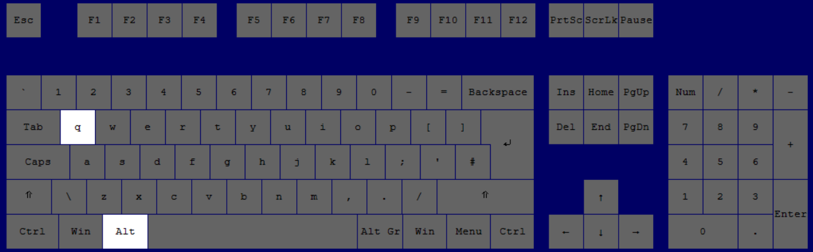

# Excel Examples

## Helpful Excel Shortcuts

### Microsoft Search - `Alt`+`Q`

Microsoft Search is a new feature in Excel that allows you to search for commands, help topics, and more. To access Microsoft Search, press `Alt`+`Q` on your keyboard. This will open a search bar at the top of the Excel window where you can type in your search query. For example, if you type "Bold" in the search bar, Excel will show you the `Bold` command in the search results. You can then click on the command to apply it to your selected text.

Additionally, you can right-click on any command in the search results to add it to the Quick Access Toolbar for easy access in the future.

For Mac users, the equivalent shortcut is `Command`+`Shift`+`/` (forward slash).

---
