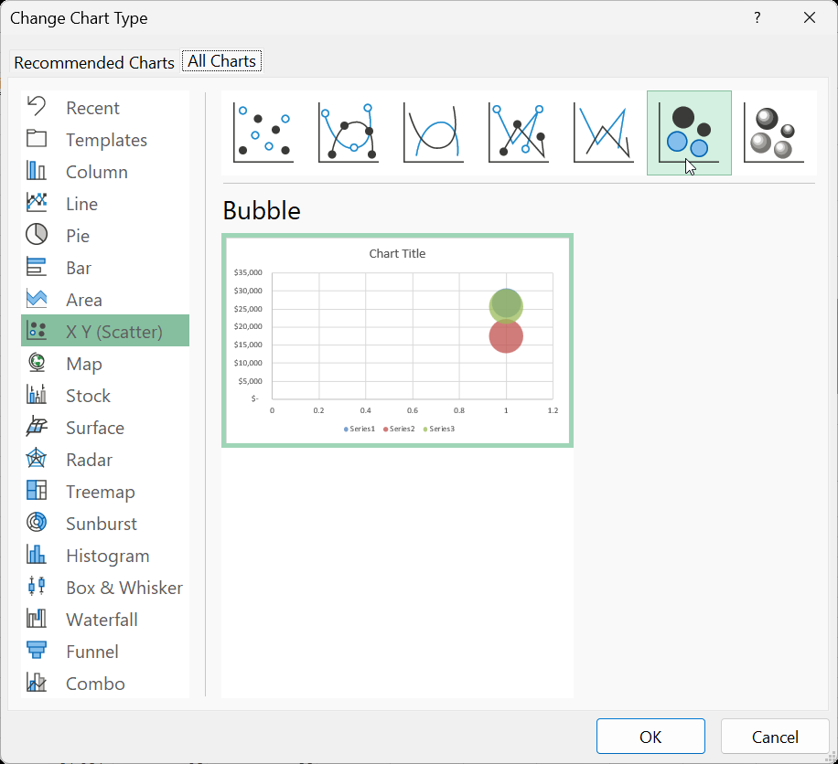

# How to Create a Bubble Chart in Excel`

Creating a bubble chart in Excel involves several steps. Here’s a detailed guide to help you through the process:

## Example

### Step 1: Prepare Your Data

Before creating a bubble chart, you need to organize your data properly. A bubble chart typically requires three sets of values: X values, Y values, and bubble sizes.

Example data:
| Category | X Value | Y Value | Bubble Size |
|----------|---------|---------|-------------|
| A        | 10      | 20      | 30          |
| B        | 15      | 25      | 40          |
| C        | 20      | 30      | 50          |

### Step 2: Insert the Bubble Chart

1. **Open Excel**: Open your Excel workbook or create a new one.
2. **Enter Data**: Enter your data in the spreadsheet in a format similar to the example above.
3. **Select Data**: Highlight the range of cells that contain your data.

### Step 3: Create the Bubble Chart

1. **Insert Chart**:
    - Go to the `Insert` tab on the Ribbon.
    - In the `Charts` group, click on the `Scatter Chart` or `Bubble Chart` dropdown.
    - Choose `Bubble Chart` from the options.
    

### Step 4: Customize the Bubble Chart

1. **Add Chart Title**:
    - Click on the chart title area and enter your desired title.
2. **Adjust Axes**:
    - Right-click on the X or Y-axis to format them. You can set minimum and maximum values, change the scale, and more.
3. **Format Bubbles**:
    - Click on any bubble in the chart. This will select all bubbles.
    - Right-click and choose `Format Data Series`. Here you can change the fill color, border, and transparency of the bubbles.
4. **Add Data Labels**:
    - Right-click on a bubble and select `Add Data Labels` to show the data values.
    - Customize the data labels by right-clicking and selecting `Format Data Labels`.

### Step 5: Fine-Tune the Chart

1. **Legend**: Adjust the legend by clicking on it and dragging it to your desired position.
2. **Gridlines**: Add or remove gridlines by clicking on the chart area, then going to the `Chart Tools` on the Ribbon, and selecting `Add Chart Element > Gridlines`.
3. **Data Source**: Modify the data source if needed by right-clicking on the chart and selecting `Select Data`.

### Step 6: Save Your Work

- Save your Excel workbook by clicking on `File` and then `Save As`. Choose your desired location and file format.

By following these steps, you will be able to create a well-organized and visually appealing bubble chart in Excel.
