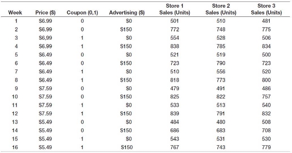
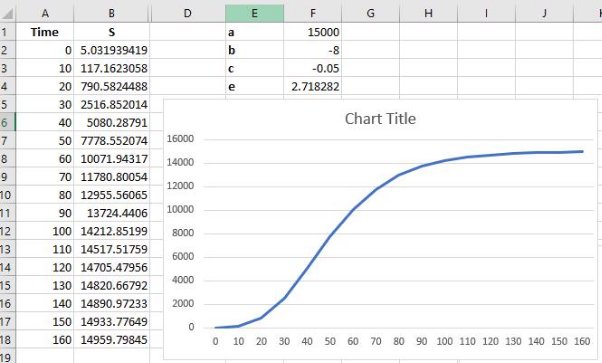
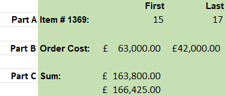
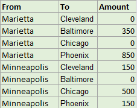


# Data Analytics - Chapter 2 Assessment

## Question 1

Example 1.8 (A Sales-Promotion Decision Model) (and 1.7 Breakeven Decision Model)  from last week’s notes (Page 18) provided data from an experiment to identify the relationship between sales and **pricing**, **coupon**, and **advertising** strategies.  

1. In the **Chapter 2 Assessment – Workbook** on Moodle in the **Question 1 worksheet**, implement the model in the example within your spreadsheet to estimate the sales for each of the weekly experiments in Column H.  
1. Graph the Sales for the 3 stores and the Model prediction all on 1 graph for comparison.  
1. Compute the average sales for the three stores and find the differences between the averages and the model estimates for each week (from cells E19 to H19).

Sales = 500 - 0.05(price) + 30(coupons) + 0.08(advertising) + 0.25(price)(advertising)

## Question 2

A pharmaceutical manufacturer has projected net profits for a new drug that is being released to the market over the next five years: 

| Year | Net Profit      |
|------|-----------------|
| 1    | €300,000,000.00 |
| 2    | €145,000,000.00 |
| 3    | €50,000,000.00  |
| 4    | €125,000,000.00 |
| 5    | €530,000,000.00 |

1\.  In the **Question 2 worksheet** to find the net present value (NPV) of these cash flows for a 

discount rate of 3%. Put your answer in Cell B11. Use the value stored in B9 in your formula. 

## Question 3

Example 1.4 in Chapter 1 described a scenario for new product sales that can be characterized by a formula called a Gompertz curve: S = aebe^ct => a\*e^(b\*e^(ct)). 

1. In the **Question 3 worksheet** calculate sales using the above formula and these values: 
   1. Time = 0 to 160 in increments of 10 (where t =Time). 
   1. when a = 15000, b = -8, and c = -0.05. 
   1. You should have 2 columns, 1 for Time (0 to 160) n column A and 1 for Sales (the formula) in column B. There will be 4 values hard coded in for a, b, c & e (you can let e = 2.718282), use **relative & absolute** (for a, b, c & e) addressing. 
1. Create a graph of the Curve. 

Sample Table: 

## Question 4

The **Question 4 worksheet** shows the prices charged and different product sizes.  

1\.  In cell B15, using VLOOKUP & an IF-statement function, compute the price when any 

product type, size, and order quantity are entered in cells B10, B11 & B12. (See page 13, slide 26 for example). For example if The type (B10) is ‘D’, the Size (B11) is ‘M’ and the Quantity (B12) is 2, the price should be €10.00. 

## Question 5 

For the following exercises use the **Question 5 worksheet** data table. Use **MATCH** and/or **INDEX** functions to find the following (show Item Description): 

1) The row numbers corresponding to the first and last (match-type) instance of item number **1369** in column C (be sure Data is sorted by Item number). Remember it will return the index of the array and the array/data has 3 rows of other information before it. Enter your answers in cells M3 and N3. 
1) The order cost associated with the first and last instance of item 1369 that you identified in part (a). Put your answers in cells M5 and N5. 
1) The total cost of all orders for item 1369. Use the answers to parts (a) and (b) along with the SUM function to do this. In other words, you should use the appropriate INDEX and MATCH functions within the SUM function to find the answer. (Remember the values will all be one after the other). Put your answer in cells M7. 

￿  Validate your results by applying the SUM function directly to the data in column G. 

Put your answer in cells M8 

## Question 6 

Use **INDEX** and **MATCH** functions to fill in a table that extracts the amounts shipped between each pair of cities in the **Question 6 worksheet.** Your table should display as below, and the formula for the amount (Cells J4 to J11) should reference the names in the From and To columns (This will require absolute and relative values): 

