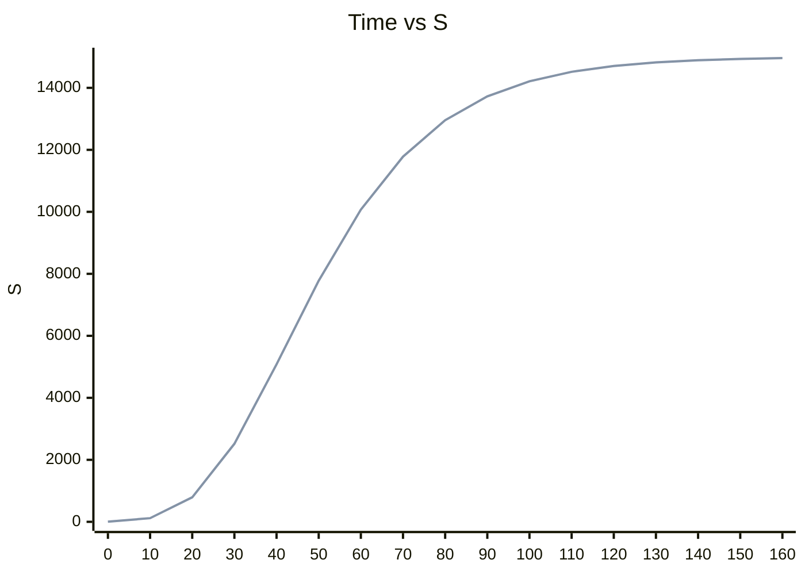


# Spreadsheet Data Analytics - Assessment

## Question 1

Example 1.8 (A Sales-Promotion Decision Model) (and 1.7 Breakeven Decision Model)  from last week’s notes (Page 18) provided data from an experiment to identify the relationship between sales and **pricing**, **coupon**, and **advertising** strategies.  

1. In the **Chapter 2 Assessment – Workbook** on Moodle in the **Question 1 worksheet**, implement the model in the example within your spreadsheet to estimate the sales for each of the weekly experiments in Column `H`.  
2. Graph the Sales for the 3 stores and the Model prediction all on 1 graph for comparison.  
3. Compute the average sales for the three stores and find the differences between the averages and the model estimates for each week (from cells `E19` to `H19`).

| Week | Price | Coupon | Advertising | Store 1 Unit Sales | Store 2 Unit Sales | Store 3 Unit Sales |
|-----:|------:|-------:|------------:|-------------------:|-------------------:|-------------------:|
|    1 | €6.99 |      0 |       €0.00 |                501 |                510 |                481 |
|    2 | €6.99 |      0 |     €150.00 |                772 |                748 |                775 |
|    3 | €6.99 |      1 |       €0.00 |                554 |                528 |                506 |
|    4 | €6.99 |      1 |     €150.00 |                838 |                785 |                834 |
|    5 | €6.49 |      0 |       €0.00 |                521 |                519 |                500 |
|    6 | €6.49 |      0 |     €150.00 |                723 |                790 |                723 |
|    7 | €6.49 |      1 |       €0.00 |                510 |                556 |                520 |
|    8 | €6.49 |      1 |     €150.00 |                818 |                773 |                800 |
|    9 | €7.59 |      0 |       €0.00 |                479 |                491 |                486 |
|   10 | €7.59 |      0 |     €150.00 |                825 |                822 |                757 |
|   11 | €7.59 |      1 |       €0.00 |                533 |                513 |                540 |
|   12 | €7.59 |      1 |     €150.00 |                839 |                791 |                832 |
|   13 | €5.49 |      0 |       €0.00 |                484 |                480 |                508 |
|   14 | €5.49 |      0 |     €150.00 |                686 |                683 |                708 |
|   15 | €5.49 |      1 |       €0.00 |                543 |                531 |                530 |
|   16 | €5.49 |      1 |     €150.00 |                767 |                743 |                779 |

$\text{Sales} = 500 - 0.05 \cdot \text{Price} + 30 \cdot \text{Coupon} + 0.08 \cdot \text{Advertising} + 0.25 \cdot \text{Price} \cdot \text{Advertising}$

```excel
=500 - 0.05 * [@Price] + 30 * [@Coupon] + 0.08 * [@Advertising]  + 0.25 * [@Price] * [@Advertising]
```

## Question 2

A pharmaceutical manufacturer has projected net profits for a new drug that is being released to the market over the next five years:

| Year |      Net Profit |
|------|----------------:|
| 1    | €300,000,000.00 |
| 2    | €145,000,000.00 |
| 3    |  €50,000,000.00 |
| 4    | €125,000,000.00 |
| 5    | €530,000,000.00 |

1. In the **Question 2 worksheet** to find the net present value (NPV) of these cash flows for a discount rate of `3%`. Put your answer in Cell `B11`. Use the value stored in `B9` in your formula.

## Question 3

Example 1.4 in Chapter 1 described a scenario for new product sales that can be characterized by a formula called a `Gompertz` curve: $S = ae^{be^{ct}}$

1. In the **Question 3 worksheet** calculate sales using the above formula and these values:
   - Time = 0 to 160 in increments of 10 (where t = Time).
   - when `a` = 15000, `b` = -8, and `c` = -0.05.
   - You should have 2 columns, 1 for `Time` (0 to 160) n column `A` and 1 for Sales (the formula) in column `B`. There will be 4 values hard coded in for a, b, c & e (you can let e = 2.718282), use **relative & absolute** (for a, b, c & e) addressing.
2. Create a graph of the Curve.

Sample Tables:

| Variable |     Value |
|----------|----------:|
| a        | 15,000.00 |
| b        |     -8.00 |
| c        |     -0.05 |
| $e$      |      2.72 |

| Time |         S |
|-----:|----------:|
|    0 |      5.03 |
|   10 |    117.16 |
|   20 |    790.58 |
|   30 |  2,516.85 |
|   40 |  5,080.29 |
|   50 |  7,778.55 |
|   60 | 10,071.94 |
|   70 | 11,780.80 |
|   80 | 12,955.56 |
|   90 | 13,724.44 |
|  100 | 14,212.85 |
|  110 | 14,517.52 |
|  120 | 14,705.48 |
|  130 | 14,820.67 |
|  140 | 14,890.97 |
|  150 | 14,933.78 |
|  160 | 14,959.80 |

```excel
=VariableA  *VariableE ^ (VariableB * VariableE ^ (VariableC * [@Time]))
```



## Question 4

The **Question 4 worksheet** shows the prices charged and different product sizes.  

In cell `B15`, using `VLOOKUP` & an `IF` function, compute the price when any product type, size, and order quantity are entered in cells `B10`, `B11` & `B12`. For example if the `Type` (`B10`) is `D`, the `Size` (`B11`) is `M` and the `Quantity` (`B12`) is `2`, the `Price` should be `€10.00`.

## Question 5

For the following exercises use the **Question 5 worksheet** data table. Use `MATCH` and/or `INDEX` functions to find the following (show Item Description):

1. The row numbers corresponding to the first and last (match-type) instance of `item number` **1369** in column `C` (be sure Data is sorted by `Item number`). Remember it will return the index of the array and the array/data has 3 rows of other information before it. Enter your answers in cells `M3` and `N3`.
2. The order cost associated with the first and last instance of `item 1369` that you identified in part 1. Put your answers in cells `M5` and `N5`.
3. The total cost of all orders for `item 1369`. Use the answers to parts 1 and 2 along with the `SUM` function to do this. In other words, you should use the appropriate `INDEX` and `MATCH` functions within the `SUM` function to find the answer. (Remember the values will all be one after the other). Put your answer in cells `M7`.
   - Validate your results by applying the `SUM` function directly to the data in column `G`.

Put your answer in cells `M8`

|                           |       First |       Last |
|---------------------------|------------:|-----------:|
| **Part A - Item # 1369:** |          14 |         16 |
| **Part B - Order Cost:**  |  £63,000.00 | £42,000.00 |
| **Part C - Sum:**         | £163,800.00 |            |
|                           | £163,800.00 |            |

## Question 6

Use `INDEX` and `MATCH` functions to fill in a table that extracts the amounts shipped between each pair of cities in the **Question 6 worksheet.** Your table should display as below, and the formula for the amount (Cells `J4` to `J11`) should reference the names in the From and To columns (This will require absolute and relative values):

| From        | To        | Amount |
|-------------|-----------|-------:|
| Marietta    | Cleveland |      0 |
| Marietta    | Baltimore |    350 |
| Marietta    | Chicago   |      0 |
| Marietta    | Phoenix   |    850 |
| Minneapolis | Cleveland |    150 |
| Minneapolis | Baltimore |      0 |
| Minneapolis | Chicago   |    500 |
| Minneapolis | Phoenix   |    150 |

---
